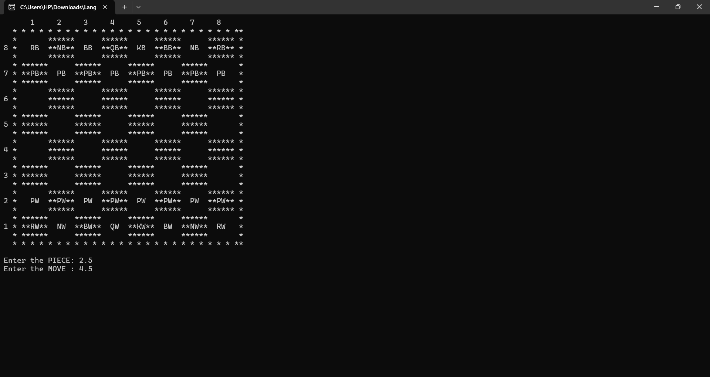

# ♟️ Chess Game in C

A simple console-based Chess program that displays an ASCII chessboard, allows you to move pieces using coordinate inputs, and tracks captured black and white pieces.
This was one of my earliest programming projects created during my first year of university using only basic C concepts.

📌 Overview

This program runs entirely in the command line. It prints a visual 8×8 chessboard and shows the initial positions of all pieces.
You can select a piece and then choose a destination square to “move” it.

✔️ The board updates after each move 
✔️ Captured pieces are recorded and displayed 
✔️ Both white and black pieces can be moved 
✔️ No OOP or advanced rules — simple logic only

# 📍 How the Program Works
1. Board Display 
The program prints a stylized chessboard using ASCII formatting.

  Black squares are drawn with ****** 
  White squares are drawn with spaces 
  Pieces use 2-letter codes:

  R = Rook 
  N = Knight 
  B = Bishop 
  Q = Queen 
  K = King 
  P = Pawn 
  W = White piece 
  B = Black piece

Example:

  PW = White Pawn 
  RB = Black Rook

# 📍 How to Play / Input Format  
➤ Step 1: Enter the position of the piece you want to move

  Format : row.column 
  Example: 2.1
  
  This means: Row 2, Column 1 on the printed board.

➤ Step 2: Enter the destination position 
  Again in the same format: row.column

# 📍 Important: Coordinate System Explanation  
The board is displayed with rows numbered 8 to 1 (top to bottom). 
So the input uses the visual row numbers shown on the left side.

Example:
If you want to move the white pawn at row 7, column 2:  
  Enter the PIECE: 7.2
Then move it to row 5, column 2:
  Enter the MOVE: 5.2

✔️ Example 1: Moving a White Pawn
  White pawn at 7.1 → move to 5.1 
    Enter the PIECE: 7.1 
    Enter the MOVE: 5.1 
  Board updates, pawn appears on new square.

# 📍 Capture System Explained

If you move onto a square containing an opponent’s piece, the program automatically: 
✔️ Detects the color 
✔️ Stores the piece into the correct captured-list array 
✔️ Increments the capture count 
✔️ Replaces that square with your piece 

Two lists are maintained:

  Black pieces captured 
  White pieces captured 

Example output: 
  Captured Black PIECES: 2 --> PB, NB, 
  Captured White PIECES: 1 --> PW, 

✔️ Example 2: Capturing an Opponent Piece 
Let’s say a white piece moves onto a black piece’s square: 
  Enter the PIECE: 5.3 
  Enter the MOVE: 4.3 
  
If a black piece exists at (4,3): 
  ➡️ It is added to the Captured Black Pieces list. 
  ➡️ The white piece replaces it on the board. 

Captured pieces print like: 
  Captured Black PIECES: 1 --> PB,

# 📍 Stopping the Program

To exit the game: 
  Enter the PIECE: 0.0 
The program prints: 
  Congratulations WINNER!!! 

# ⚠️ Limitations (Because This Is a Beginner Project)

This program does NOT enforce the rules of chess:

  ❌ No check/checkmate rules 
  ❌ No movement validation (knight moves, diagonal rules, etc.) 
  ❌ No turns (you can move any piece anytime) 
  ❌ No en passant, castling, promotions 
  ❌ No game-end logic 

It’s purely a manual movement simulator with capture tracking — but perfect for a beginner-level C project.

# 📍 How to Compile & Run

  Compile with GCC 
    gcc chess.c -o chess  
  Run 
    Linux/Mac: ./chess 
    Windows CMD: chess.exe 
      
# 📍 Demo 
A short demo video showing gameplay is included.

# 📚 What I Learned from This Project

- Working with 2D arrays 
- String manipulation in C 
- Designing a CLI-based board layout 
- Handling coordinates and mapping user input 
- Basic game-state updates 
- Tracking captures with arrays 
